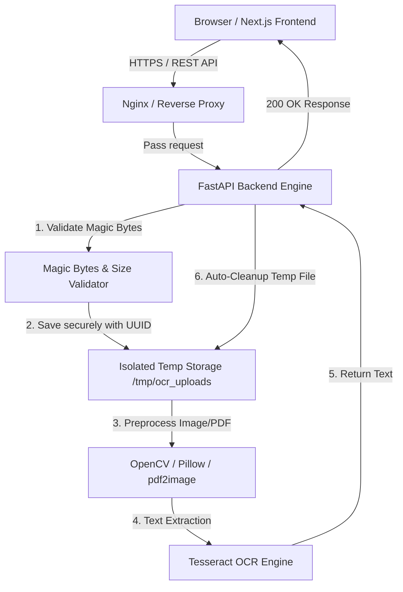

# System Architecture: OCR SaaS Monorepo

## 1. High-Level Architecture Overview

The **ocr-saas** application is a production-oriented, light-weight, anonymous Optical Character Recognition system designed for high performance, privacy, and user experience. 



---

## 2. Directory Structure

```
ocr-saas/
├── docs/
│   ├── architecture.md           # System architecture, workflows, & design decisions
│   ├── api-specification.md      # OpenAPI / REST API detail specs
│   └── security-deployment.md    # Security model, temp file lifecycle, Docker setup
├── frontend/                     # Next.js TypeScript Web App
│   ├── src/
│   │   ├── app/                  # Next.js App Router (Landing Page, Layout)
│   │   ├── components/           # UI Components (Dropzone, Preview, Controls, Header)
│   │   ├── hooks/                # Custom hooks (useOCR, useFileValidation)
│   │   ├── services/             # API client services
│   │   └── types/                # TypeScript interfaces and schemas
│   ├── public/                   # Static assets & favicons
│   ├── package.json
│   ├── tsconfig.json
│   ├── tailwind.config.js
│   └── Dockerfile
├── backend/                      # Python FastAPI Application
│   ├── app/
│   │   ├── api/                  # FastAPI routers (/ocr, /health, /languages)
│   │   ├── core/                 # App configuration & env variables
│   │   ├── services/             # Validation service, OCR engine, file manager
│   │   ├── models/               # Pydantic request/response models
│   │   └── main.py               # FastAPI entrypoint & CORS setup
│   ├── tests/                    # pytest unit & integration test suite
│   ├── requirements.txt
│   └── Dockerfile
├── infrastructure/               # Container & Reverse Proxy Orchestration
│   ├── nginx/
│   │   └── default.conf          # Nginx routing & body limit configuration
│   └── docker-compose.yml        # Orchestration for Frontend, Backend, and Nginx
├── README.md                     # Comprehensive Setup & Quickstart Guide
└── .env.example                  # Environment configuration template
```

---

## 3. Technology Stack & Key Decisions

| Tier | Technology | Purpose | Key Rationale |
| :--- | :--- | :--- | :--- |
| **Frontend** | Next.js 14+, TypeScript, Tailwind CSS | UI Landing Page & Client App | Fast server & client component rendering, zero-lag UI, responsive styles |
| **Backend Framework** | Python 3.11+, FastAPI, Pydantic v2 | Async API Server | High performance async request handling, auto-generated OpenAPI docs |
| **OCR Engine** | PyTesseract (Tesseract 5 OCR) | Character Extraction | Battle-tested, accurate open-source OCR supporting multi-language datasets |
| **Image & PDF Processing**| OpenCV (`opencv-python-headless`), Pillow, `pdf2image` | Pre-processing | Grayscale conversion, thresholding, noise reduction, and PDF page rasterization |
| **Validation** | Binary Magic Byte Matching | File Security | Prevents malicious executable uploads disguised as images/PDFs |
| **Containerization** | Docker, Docker Compose, Nginx | Infrastructure | Standardized deployment environment with hardware library isolation |

---

## 4. Security & Temporary File Lifecycle

1. **Magic Byte Inspection**: Incoming byte streams are checked against known binary headers:
   - `JPEG`: `FF D8 FF`
   - `PNG`: `89 50 4E 47 0D 0A 1A 0A`
   - `WEBP`: `52 49 46 46 ... 57 41 56 45 / 57 45 42 50`
   - `PDF`: `%PDF-` (`25 50 44 46 2D`)
2. **Path Obfuscation & UUID Isolation**: Files are assigned a random `uuid4()` string (e.g. `9f3c5b74-1234-4567-89ab-cdef01234567.tmp`) in `/tmp/ocr_uploads/`. Original user filenames are never written to disk or exposed in server logs.
3. **Automated Destruction**: FastAPI `BackgroundTasks` + Python `try...finally` context managers guarantee file deletion immediately after OCR completes, preventing disk fill attacks.
4. **Strict Payload Enforcers**: File size limit (`MAX_FILE_SIZE_MB`, default 10MB) is strictly enforced in both Nginx `client_max_body_size` and FastAPI stream checkers.

---

## 5. API Contract Specifications

### `POST /api/v1/ocr`
Extracts text from an uploaded image or PDF file.

- **Request Headers**: `Content-Type: multipart/form-data`
- **Form Data Parameters**:
  - `file`: `UploadFile` (Required) - Image or PDF file (`.jpg`, `.jpeg`, `.png`, `.webp`, `.pdf`).
  - `language`: `string` (Optional) - OCR language code (`eng`, `deu`, `fra`, `spa`). Default: `eng`.

- **Response 200 OK** (`application/json`):
```json
{
  "success": true,
  "filename": "d3b07384-d113-42a6-a194-e0c18d343460.png",
  "language": "eng",
  "text": "Extracted text content from document...",
  "page_count": 1,
  "processing_time_ms": 342.5
}
```

- **Response 400 Bad Request** (Invalid magic bytes or corrupted file):
```json
{
  "detail": "Invalid file format. Magic byte validation failed for detected signature."
}
```

- **Response 413 Payload Too Large** (File size exceeds limit):
```json
{
  "detail": "File size exceeds maximum allowed limit of 10 MB."
}
```

- **Response 415 Unsupported Media Type** (Disallowed extension/MIME):
```json
{
  "detail": "Unsupported file type. Allowed formats: JPG, JPEG, PNG, WEBP, PDF."
}
```

- **Response 422 Unprocessable Entity** (Missing fields):
```json
{
  "detail": "Validation error: 'file' parameter is required."
}
```

### `GET /api/v1/health`
Health check endpoint for container probes and deployment monitoring.
- **Response 200 OK**:
```json
{
  "status": "healthy",
  "ocr_engine": "tesseract 5.x",
  "version": "1.0.0"
}
```

### `GET /api/v1/languages`
Lists currently installed and available Tesseract language models.
- **Response 200 OK**:
```json
{
  "languages": [
    {"code": "eng", "name": "English"},
    {"code": "deu", "name": "German"},
    {"code": "fra", "name": "French"},
    {"code": "spa", "name": "Spanish"}
  ]
}
```
